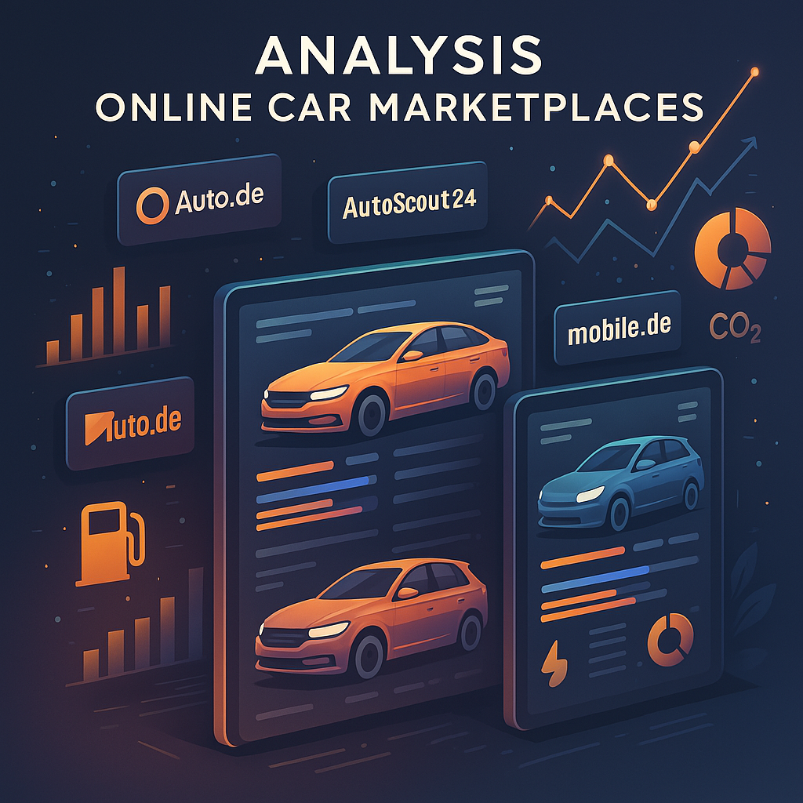

# Analysis of Online Car Marketplaces
This project analyzes used car listings from major German online platforms – **Auto.de**, **AutoScout24**, and **Mobile.de** – with the goal of comparing prices, fuel efficiency, and environmental performance. The project includes:

- A full **data pipeline** (crawling → transformation → modeling)
- Comparative **marketplace analysis**
- Imputation of missing fuel consumption values using **machine learning**
- A final report and **interactive dashboard** hosted on [Streamlit] <https://german-marketplace-car-comparison.streamlit.app>

## Project Structure

```bash
├── Data/
│   ├── Auto.de_Data.csv
│   ├── autoscout_data.csv
│   ├── car_mobile.csv
│   ├── crawled_output.csv
│   └── imputed_output.csv
│
├── crawler/
│   ├── __init__.py
│   ├── CarsFetcher.py
│   └── CrawledCar.py
│
├── transform/
│   ├── __init__.py
│   ├── DataCleaner.py
│   └── DataEnricher.py
│
├── load/                   
│   ├── __init__.py
│   ├── data_loader.py
│   ├── preprocessor.py
│   ├── model_trainer.py
│   ├── feature_analysis.py
│   └── imputer.py
│
├── miscellaneous/
│   ├── car_brand.json
│   ├── Analysis_Online_Car.png
│   └── importance.png
│
├── .gitignore
├── README.md
├── requirements.txt
├── analysis.py
├── autoscout_crawler.py
├── streamlit_app.py
└── transform.py
```


## Dataset

| Column Name           | Data Type   | Description                                                                                                                                                                                              |
|:----------------------|:------------|:---------------------------------------------------------------------------------------------------------------------------------------------------------------------------------------------------------|
| Index                 | integer     | Index                                                                                                                                                                                                    |
| Brand                 | string      | Brand name of the vehicle                                                                                                                                                                                |
| Model                 | string      | Specific model of the car                                                                                                                                                                                |
| YearMonth             | date        | Month and year of registration                                                                                                                                                                           |
| Kilometer             | integer     | Mileage in kilometers                                                                                                                                                                                    |
| Gear_Type             | categorical | Transmission type                                                                                                                                                                                        |
| Fuel_Type             | categorical | Type of fuel used                                                                                                                                                                                        |
| Consumption           | float       | Fuel consumption (L/100 km); missing values imputed. NA were imputed using a machine learning model                                                                                                      |
| CO2_g_km              | integer     | CO₂ emissions in g/km                                                                                                                                                                                    |
| Power_PS              | integer     | Engine power in PS                                                                                                                                                                                       |
| Price_per_km          | float       | Price divided by km                                                                                                                                                                                      |
| cleaned_Price         | float       | Final cleaned price in EUR                                                                                                                                                                               |
| Fuel_Cost_per_100km   | float       | Calculated fuel cost per 100 km                                                                                                                                                                          |
| Annual_Fuel_Cost      | float       | Average cost based on yearly mileage (18,507 km)                                                                                                                                                         |
| CO2_per_year          | float       | Yearly CO₂ emissions in kg                                                                                                                                                                               |
| CO2_Emission_Category | Logical     | Above or below 4600 kg threshold (EPA, 2018)                                                                                                                                                             |
| Marketplace           | string      | Source marketplace (Auto.de, Autoscout, etc.)                                                                                                                                                            |
| log_cleanned_price    | float       | Log-transformed price                                                                                                                                                                                    |
| log_price_per_km      | float       | Log-transformed price per km                                                                                                                                                                             |
| log_CO2_Emission      | float       | Log-transformed CO₂ emissions                                                                                                                                                                            |
| log_CO2_per_year      | float       | Log-transformed yearly CO₂                                                                                                                                                                               |
| car_age               | float       | Calculated age (in years) as of 2025                                                                                                                                                                     |


## Virtual Environment 
Create virtual environment by opening a terminal in project folder and run: 

`python3 -m venv venv`

### Active Venv with the following command: 

Windows: 
`venv\Scripts\activate`

Mac/Linux: 
`source venv/bin/activate`

### Install Requirements 

To install all python packages in your local virtual environment run: 
`pip3 install -r requirements.txt`

Show list of installed packages:
`pip3 list`

## Run Analysis Script
python analysis.py

## Launch Streamlit Dashboard
streamlit run streamlit_app.py

## Updating Dependencies
After you install a new packages you can create an updated requirements.txt file and push it to github

`pip freeze > requirements.txt`

## Gitignore Setup
Make sure to exclude local dev folders and environments:
`echo "venv/" >> .gitignore`
`echo ".idea/" >> .gitignore`
git add .gitignore
git commit -m "Ignore virtualenv and IDE files"

## Summary of Key Results

- **Auto.de** shows higher average prices, particularly for premium brands – likely due to a stronger focus on dealer listings.
- **Fuel consumption and CO₂ emissions** are lower on AutoScout24, suggesting a more eco-focused vehicle selection.
- **XGBoost** and **Random Forest** outperformed all other ML models in predicting missing fuel consumption values (RMSE ≈ 0.09).
- Feature importance analysis revealed that **CO₂ emissions**, **Kilometer**, **Cleaned Proice** and **Car Age** are the most influential predictors of consumption.

## Licence
This project is developed as part of the **CIP course at HSLU – MSc in Applied Information and Data Science.**
